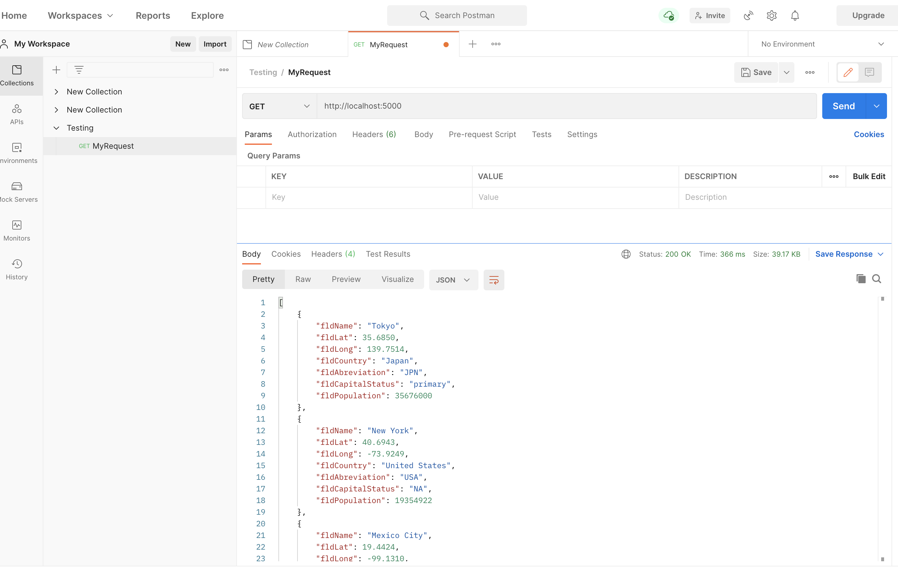
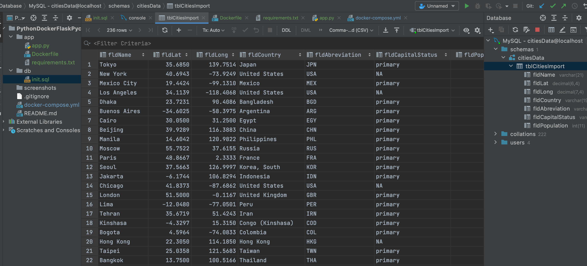

# PythonDockerFlaskPycharm
# Python Description
This project is a homework assignments to teach how to get the Pycharm setup with Docker, Flask and MYSQL

[Download Assignment PDF Here](PPFSQL-Homework.pdf)

[View Assignment Video Here](https://youtu.be/QbMWNgrfAFg)

# Postman Screenshot

# SQL Data Screenshot

